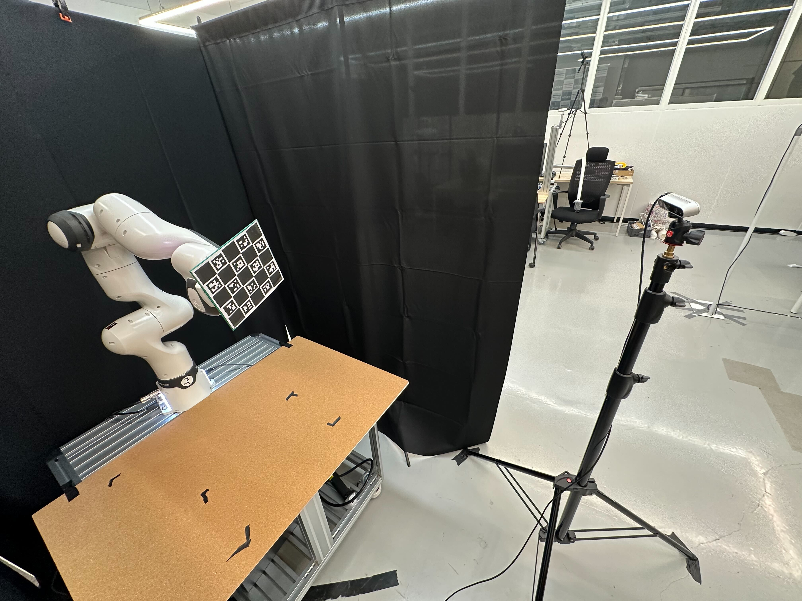
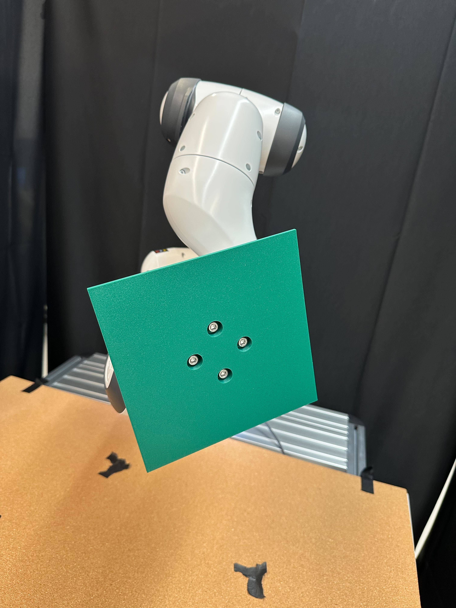
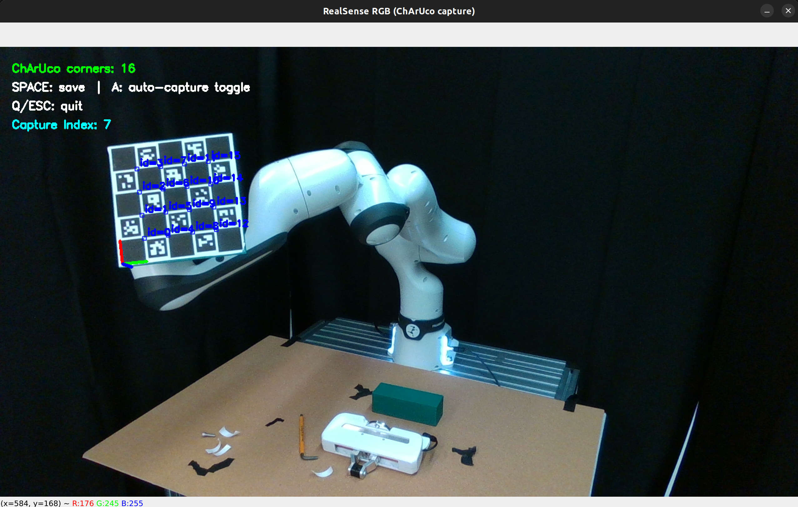
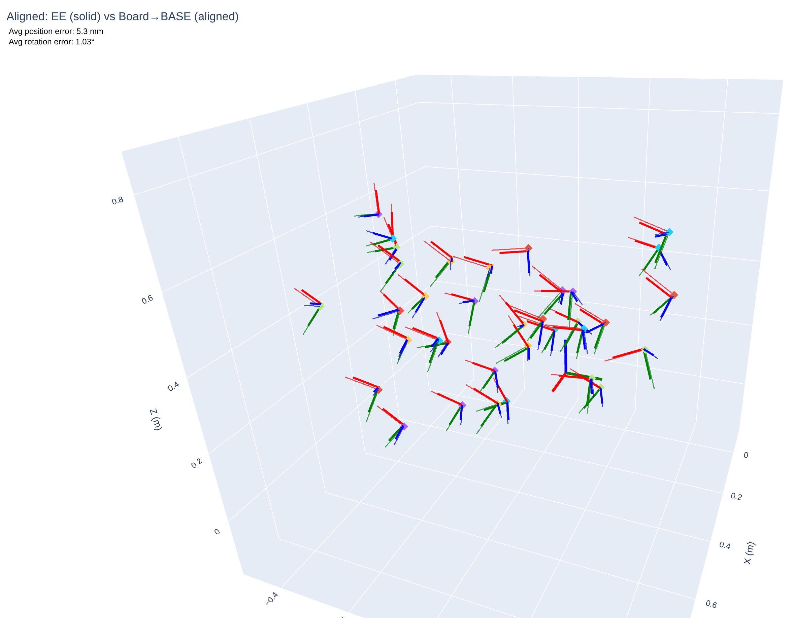

# Eye-to-Hand Calibration for Franka Research 3 & RealSense

This repository provides a pipeline for performing **Eye-to-Hand calibration** between a Franka Research 3 robot arm and an Intel RealSense camera. The core of the calibration process relies on OpenCV's `cv2.calibrateRobotWorldHandEye` function, with ChArUco board.

<div align="center">
  
  
  
</div>

## 🌟 Key Features

* **ROS-Free**: Operates independently without requiring the Robot Operating System (ROS).
* **ChArUco-Based**: Utilizes a ChArUco board (Chessboard + ArUco) for robust and precise marker detection.
* **Board 3D Model to Print**: Printable 3D model for mounting a ChArUco board on the robot arm’s end-effector.

## 📅 To-Do
- [ ] Refine the calibration process to improve accuracy.
- [ ] Integrate intrinsic and Eye-to-Hand calibration into a unified workflow.
- [ ] Update the code to support any camera and robot arm.

## 🛠️ Prerequisites

### Hardware
* Franka Research 3 robot arm
* Intel RealSense Camera
* (Optional) 3D Printed Board Holder
    - This repository includes STL files (`./docs/robot_cali_board.stl`) for a 3D-printable frame to hold the ChArUco board at robot end-effector. While this is recommended for stability, any flat and rigid surface will work.


### Software
1.  **Install Python dependencies**:
    ```shell
    pip install -r requirements.txt
    ```

2.  **Install `franky`**:
    This library is required to control the Franka Research 3 robot via Python.
    * [franky GitHub Repository](https://github.com/TimSchneider42/franky)


## 🚀 How to Use
You can check the sample outputs in `output_sample`.

### Step 1: Generate ChArUco Board
First, generate the ChArUco board image that will be used for calibration. You can customize the board's properties (squares, marker size, DPI, etc.) in `config.yaml` to fit your needs.

```shell
python 1_generate_charuco_board.py --config config.yaml
```
💡 Note: The default configuration is set on `config.yaml`, optimized for an A4 sheet and BambooLab X1C. You should modify `DPI` for your environment.

### Step 2: (Optional) Intrinsic Camera Calibration
If you prefer to estimate the camera's intrinsic parameters yourself instead of using the factory-provided ones from the RealSense SDK, follow these steps. If you plan to use the default intrinsics, you can skip to Step 3.

**Collect Intrinsic Data (c2)**:
```shell
python c2_capture_realsense_charuco.py --config config.yaml
```

**Calibrate Intrinsics (c3)**:
```shell
python c3_calibrate_realsense_charuco.py --config config.yaml
```

**Analyze Calibration Data (c4)**:
```shell
python c4_analysis_calibration_data.py --config config.yaml
```

### Step 3: Eye-to-Hand Calibration
This step computes the transformation matrix (T_cam2base) from the camera coordinate system to the robot base coordinate system.

**Capture Robot Poses & Images (r2)**:
```shell
python r2_capture_realsense_charuco_robot_pose.py --config config.yaml
```

**Calculate the Transformation Matrix (r3)**:
```shell
python r3_T_cam2base_calibration.py --config config.yaml
```

### Step 4: Verification
Verify the accuracy of the calculated T_cam2base matrix.

**Verify with 2D Projection (r4)**:
```shell
# Using default RealSense intrinsics
python r4_validate_T_cam2base_project_ee.py --config config.yaml 

# Using your own estimated intrinsics from Step 2
python r4_validate_T_cam2base_project_ee.py --config config.yaml --i estimated_rgb_intrinsics.json
```

**Verify in 3D Space (r5)**:
```shell
python r5_validate_T_cam2base_in_3D.py -c config.yaml
```
- You can check the results like below img.
<p align="center">
  
</p>

---

## 🙏 Acknowledgements
This work was inspired by and benefits from the following repository:

[Fisheye_ChArUco_Calibration by jamiemilsom](https://github.com/jamiemilsom/Fisheye_ChArUco_Calibration)